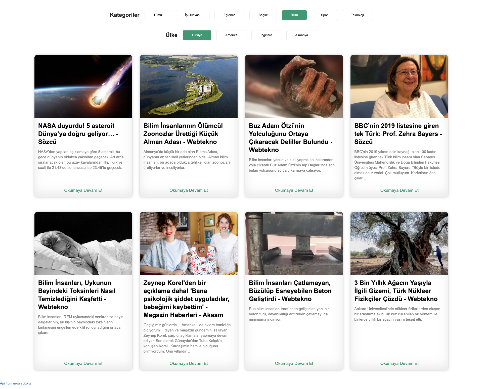

# Türkçe Basit Haber Listesi
<!-- ALL-CONTRIBUTORS-BADGE:START - Do not remove or modify this section -->

<!-- ALL-CONTRIBUTORS-BADGE:END -->

https://turk-haber-test.herokuapp.com/

You can check the top trend news in Turkey with Turk-Haber.

## Contributors

<a href="https://github.com/yusfgungor" target="_blank" rel="some text">Yusuf Güngör</a>
<!-- ALL-CONTRIBUTORS-LIST:START - Do not remove or modify this section -->
<!-- prettier-ignore-start -->
<!-- markdownlint-disable -->
<table>
  <tr>
    <td align="center"><a href="https://medium.com/@okandavut"> <b>Okan DAVUT</b></a> <a href="#infra-okandavut" title="Infrastructure (Hosting, Build-Tools, etc)">🚇</a> <a href="https://github.com/okandavut/turk-haber/commits?author=okandavut" title="Tests">⚠️</a> <a href="https://github.com/okandavut/turk-haber/commits?author=okandavut" title="Code">💻</a></td>
  </tr>
</table>

<!-- markdownlint-enable -->
<!-- prettier-ignore-end -->
<!-- ALL-CONTRIBUTORS-LIST:END -->
